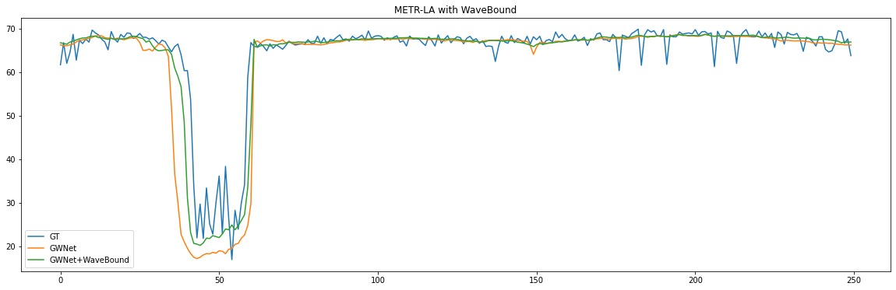

# WaveBound + GraphWaveNet

Implementation of [WaveBound: Dynamic Error Bounds for Stable Time Series Forecasting (NeurIPS 2022)](https://arxiv.org/abs/2210.14303), applied to [Graph WaveNet for Deep Spatial-Temporal Graph Modeling, IJCAI 2019](https://arxiv.org/abs/1906.00121). This repo is officially provided as examplary code for applying WaveBound method to Traffic domain. To view WaveBound's official implementation, visit the [wavebound-github-repo](https://github.com/choyi0521/WaveBound).

## Data Preparation

### Step1: Download METR-LA and PEMS-BAY data from [Google Drive](https://drive.google.com/open?id=10FOTa6HXPqX8Pf5WRoRwcFnW9BrNZEIX) or [Baidu Yun](https://pan.baidu.com/s/14Yy9isAIZYdU__OYEQGa_g) links provided by [DCRNN](https://github.com/liyaguang/DCRNN).

### Step2: Process raw data 
```bash
# Create data directories
mkdir -p data/{METR-LA,PEMS-BAY}

# METR-LA
python generate_training_data.py --output_dir=data/METR-LA --traffic_df_filename=data/metr-la.h5

# PEMS-BAY
python generate_training_data.py --output_dir=data/PEMS-BAY --traffic_df_filename=data/pems-bay.h5

```
## Train Commands

```bash
sh scripts/metr_la.sh # METR-LA
sh scripts/pems_bay.sh # PEMS-BAY
```

## Quantitative Results

### METR-LA
| STEPS           | 15min      |            |            | 30min      |            |            | 60min      |            |            |
|-----------------|------------|------------|------------|------------|------------|------------|------------|------------|------------|
| Metrics         | MAE        | RMSE       | MAPE       | MAE        | RMSE       | MAPE       | MAE        | RMSE       | MAPE       |
| GWNet           |   2.6998   |   5.1684   |   0.0693   |   3.0966   |   6.2413   |   0.0837   |   3.5812   |   7.4361   |   0.1010   |
| GWNet+WaveBound | **2.6703** | **5.1104** | **0.0691** | **3.0313** | **6.1046** | **0.0832** | **3.4478** | **7.1474** | **0.0990** |

### PEMS-BAY
| STEPS           | 15min      |            |            | 30min      |            |            | 60min      |            |            |
|-----------------|------------|------------|------------|------------|------------|------------|------------|------------|------------|
| Metrics         | MAE        | RMSE       | MAPE       | MAE        | RMSE       | MAPE       | MAE        | RMSE       | MAPE       |
| GWNet           |   1.3003   |   2.7225   |   0.0273   |   1.6171   |   3.6546   |   0.0364   |   1.9201   |   4.4375   |   0.0449   |
| GWNet+WaveBound | **1.2917** | **2.7221** | **0.0269** | **1.6080** | **3.6538** | **0.0359** | **1.9045** | **4.4103** | **0.0449** |

## Qualitative Results
